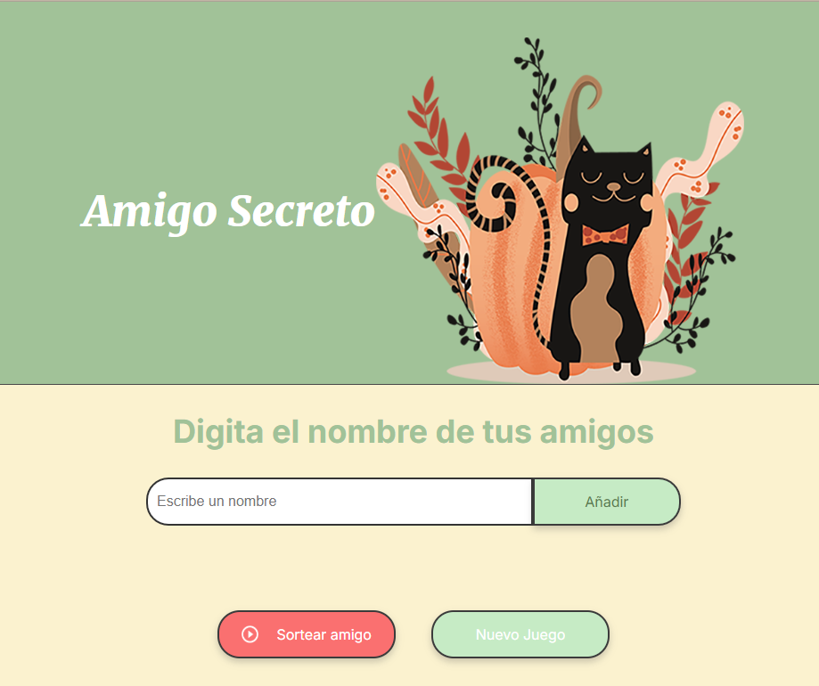
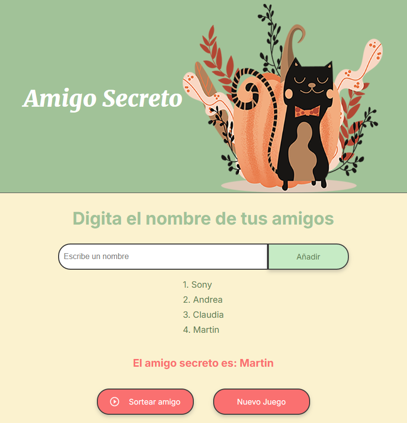

# Desafío 🚀

# 🎉 Amigo Secreto - Sorteo Aleatorio de Amigos 🎉

## 📄 Descripción

¡Bienvenido al proyecto **Amigo Secreto**! Es una aplicación web que permite a los usuarios agregar nombres de amigos a una lista y realizar un sorteo aleatorio para seleccionar un "Amigo Secreto". Es perfecta para eventos y dinámicas de grupo.

### 🌟 Características:
- **Agregar amigos:** Los usuarios pueden ingresar nombres de amigos a través de un campo de texto.
- **Sorteo aleatorio:** Con un solo clic, el sistema selecciona al azar un amigo secreto.
- **Nuevo juego:** Después de realizar el sorteo, se activa un botón para comenzar de nuevo.
- **Interactividad:** El diseño es sencillo y atractivo, con botones bien alineados y colores llamativos.

---

## 🚀 Funcionalidades

1. **Agregar Nombres:** Puedes escribir el nombre de tus amigos en el campo de texto y agregarlos a la lista visible.
2. **Validación de Entrada:** Si el campo está vacío, se muestra una alerta para que ingreses un nombre válido.
3. **Sorteo Aleatorio:** Al presionar el botón **"Sortear Amigo"**, se selecciona aleatoriamente uno de los amigos de la lista.
4. **Nuevo Juego:** Después de realizar el sorteo, se activa el botón **"Nuevo Juego"** para reiniciar la aplicación.

---

## 🛠 Tecnologías Utilizadas

- **HTML5** - Estructura de la página web.
- **CSS3** - Estilos visuales modernos y responsivos.
- **JavaScript** - Lógica de funcionamiento para agregar amigos y realizar el sorteo.
  
---

## 📷 Capturas de Pantalla

A continuación te mostramos cómo se ve la aplicación:

---

## 🏗 Instalación y Uso

### 1. Clonar el repositorio:
Para clonar este proyecto en tu máquina local, abre tu terminal y ejecuta:

git clone https://github.com/sonygahan/amigo-secreto.git

---

## 💡 Contribuciones
¡Las contribuciones son bienvenidas! Si deseas mejorar el proyecto o agregar nuevas funcionalidades, no dudes en hacer un Fork del repositorio y crear un Pull Request.}

---

## 📬 Contacto
Si tienes alguna duda o sugerencia, puedes ponerte en contacto conmigo a través de mi GitHub.

## GitHub: [SonyGahan](https://github.com/SonyGahan)

---

## 📝 Licencia
Este proyecto está bajo la Licencia MIT. Consulta el archivo [LICENSE](LICENSE) para más detalles.

---

## 💻 Agradecimientos
¡Gracias por visitar mi repositorio y por tu interés en este proyecto! 😄

## ⌨️ Construido con ❤️ por Sonia Pereira 😊